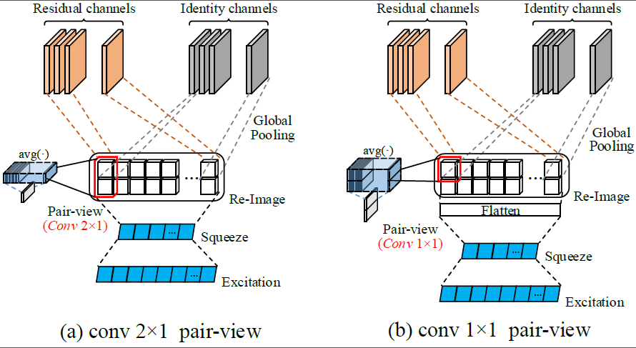
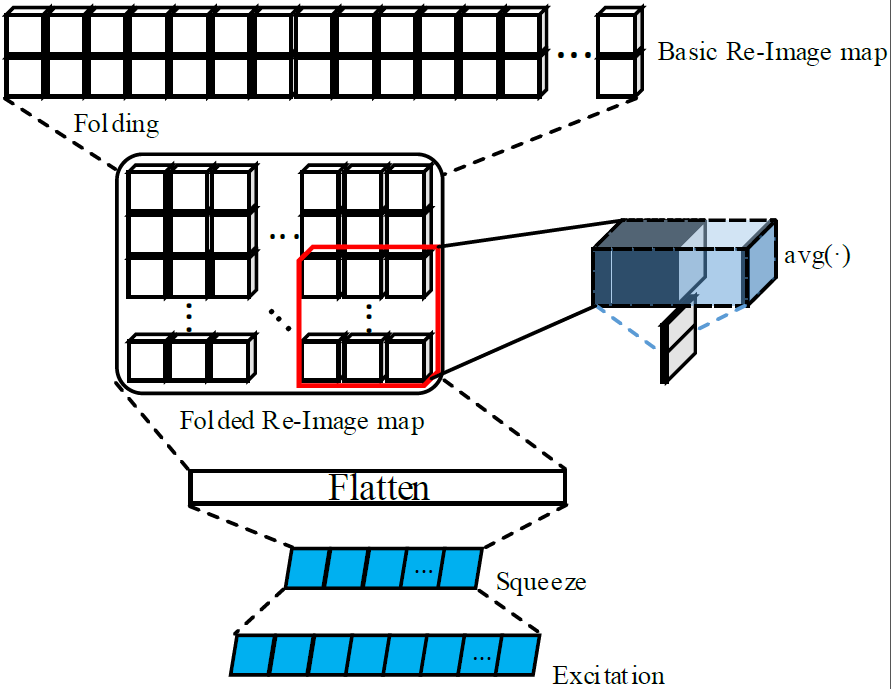
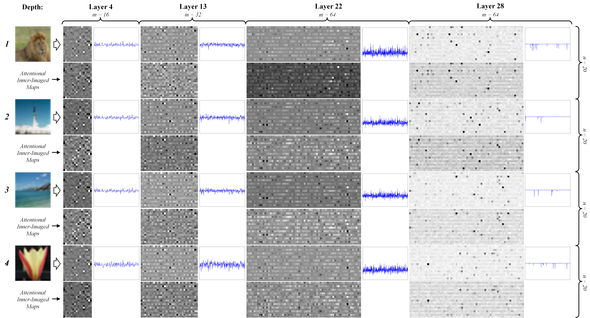

# CompetitiveSENet
---

Source code of paper: 

   **Competitive Inner-Imaging Squeeze and Excitation for Residual Network** ([https://arxiv.org/abs/1807.08920](https://arxiv.org/abs/1807.08920))

---
## Architecture

|Competitive Squeeze-Exciation Architecutre for Residual block|
|-|
||

---

SE-ResNet module and CMPE-SE-ResNet modules:

|Normal SE|Double FC squeezes|Conv 2x1 pair-view|Conv 1x1 pair-view|
|-|-|-|-|
|||||

The Novel Inner-Imaging Mechanism for Channel Relation Modeling in Channel-wise Attention of ResNets (even All CNNs):

|Basic Inner-Imaing Mode|Folded Inner-Imaging Mode|
|-|-|
|||

---

## Requirements

- **MXNet 1.2.0**
- Python 2.7
- CUDA 8.0+(for GPU)

---

## Citation

@article{hu2018competitive,  
&emsp;  title={Competitive Inner-Imaging Squeeze and Excitation for Residual Network},  
&emsp;  author={Hu, Yang and Wen, Guihua and Luo, Mingnan and Dai, Dan and Jiajiong, Ma},  
&emsp;  journal={arXiv preprint arXiv:1807.08920},  
&emsp;  year={2018}  
}

Version-1: https://arxiv.org/abs/1807.08920v2
Version-2: https://arxiv.org/abs/1807.08920v3

---

## Results
Best record of this novel model on CIFAR-10 and CIFAR-100 (used "*mixup*" ([https://arxiv.org/abs/1710.09412](https://arxiv.org/abs/1710.09412))) can achieve: **97.55%** and **84.38%**.
 
The test result on Kaggle: [CIFAR-10 - Object Recognition in Images](https://www.kaggle.com/c/cifar-10) 

Inner-Imaging Examples & Channel-wise Attention Outputs

